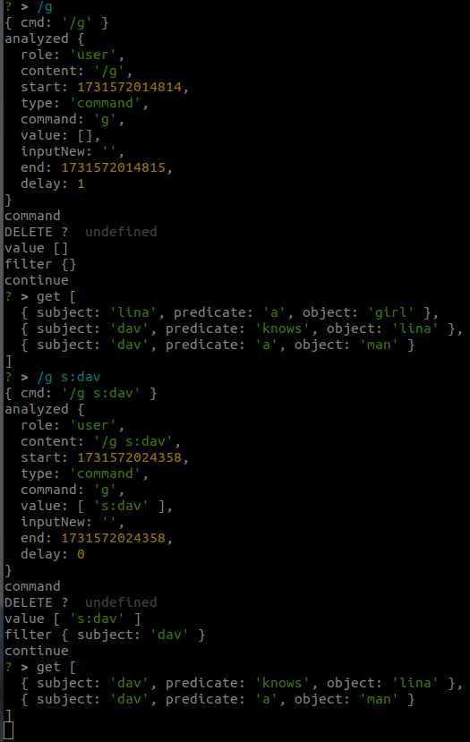

# Getting started
- first thing to start is good musik [Fip-Groove](https://www.radiofrance.fr/fip/radio-groove)
- inspired from [scenaristeur/agent](https://github.com/scenaristeur/agent), [demo](https://www.youtube.com/watch?v=YT61BcjGfwc)


# run 

```
git clone https://github.com/scenaristeur/organizm.git
cd organizm
npm install

# prod 
npm start
# dev 
npm run dev
```

# install organizm globally
```
npm run install-g
```
now organizm is accessible with the command `organizm` or shortcut `oz`


# usage

By default, data is stored and persisted in  ~/.organizm/dbs/organizm.default.db using [LevelGraph](https://github.com/levelgraph/levelgraph) 

## adding data

- (EN) To add a triple, type three words followed by a comma (,)
- (FR) pour ajouter un triplet tapez trois mots suivis d'une virgule (,)


> data insertions ends with ',' ';' '.' or '-'

>adding data follows the tripet s:p:o format (subject, predicate, object), ending with ',' ';' '.' or '-'

>see demo of another similar project that uses this syntax https://www.youtube.com/watch?v=YT61BcjGfwc


## getting and filtering data
- (EN) /g or /get with filter like s:dav (for 'subject==dav'), but it could also be 'p:knows', or 'o:lina'
- (FR) /g ou /get avec un filtre comme s:dav (pour 'sujet==dav'), mais ça pourrait également être 'p:knows', ou 'o:lina'




# commands
> commands start with '/'
- [ X ] /dbls or /dbs: list all databases
- [ X ] /db [something]: connect to a [something] database, default is /organizm.default.db
- [ X ] /get or /g : get data, accept filters (see below)

> remove a triple with !
- [ ] !dav a man

>  replace a triple with %
- % dav a man -> dav a boss,

> gestion des alias
- solid aliasof http://localhost:3000,

> gestions des
- chains de langchain https://js.langchain.com/docs/tutorials/sql_qa/
- tools de langchain, memgpt, crewai... composio https://docs.letta.com/agents/tools
- agents


# /get filters
according to https://github.com/levelgraph/levelgraph?tab=readme-ov-file#get-and-put
s = subject, p = predicate, o = object, l = limit, of = offset, r = reverse

- /get s:dav p:eat => get all data where subject is 'dav' and predicate is 'eat'


# Run a Community Solid Server
- https://communitysolidserver.github.io/CommunitySolidServer/latest/
```
# install
npm install -g @solid/community-server
# run
community-solid-server -c @css:config/file.json -f ~/.organizm/solid_data/
```
then 
- open http://localhost:3000 to see if CSS (Community Solid Server) is running 
- sigup for an account at http://localhost:3000/.account/login/password/register/
- create a pod and a token


# Run CSS with penny recipe
```
git clone https://github.com/CommunitySolidServer/Recipes css_recipes
cd css_recipes/
cd penny/
npm install
community-solid-server -c config-penny.json -f ~/.organizm/solid_data

```

# voir aussi comunica
- bug https://github.com/inrupt/solid-client-authn-js/issues/3773
- https://github.com/comunica/comunica-feature-solid


# .env
- cp .env_example to .env and replace this values with yours

```
VITE_SOLID_BASE_URL="http://localhost:3000"
VITE_SOLID_POD="http://localhost:3000/xxxxxxxxxx/"
VITE_SOLID_WEBID="http://localhost:3000/xxxxxxxxxxxx/profile/card#me"
VITE_SOLID_TOKEN_IDENTIFIER="localhost_xxxxxxxxxxxx"
VITE_SOLID_TOKEN_SECRET="xxxxxxxxxxxxxxxxxxxxxxxxx"
```
# connect to Solid Server
- add connection
```
# add connection    
/db http://localhost:3000 Solid
# get dbs
/dbs
# connect to remote
/db Solid
```


# Default Data Folder
- $HOME/.organizm/ 


# typescript ? interface or type alias ? 
- https://blog.logrocket.com/types-vs-interfaces-typescript/

# web version
- ionic-vue

# 
- no-stdin with nodedemon in dev ( known issues https://www.npmjs.com/package/inquirer#methods )https://github.com/SBoudrias/Inquirer.js/issues/844#issuecomment-736675867 

# now we can mix
- scenaristeur/os : bin install, enquirer for template/snipet
- organizm: work flow + levelgraph db, levelgraph-jsonld does not work, Solid authentified ()
- dady for graph & solid gestion
- smag-studio for llm multiagents and graph configuration

# solid tuto 
- conf, prod...
- https://github.com/CommunitySolidServer/tutorials/
- https://github.com/mrkvon/css-setup


# automatic Solid launch
configure port & loglevel in .community-solid-server.config.json
then in a separate terminal run `npm run solid`
or without login and in memory `npm run solid_in_memory`