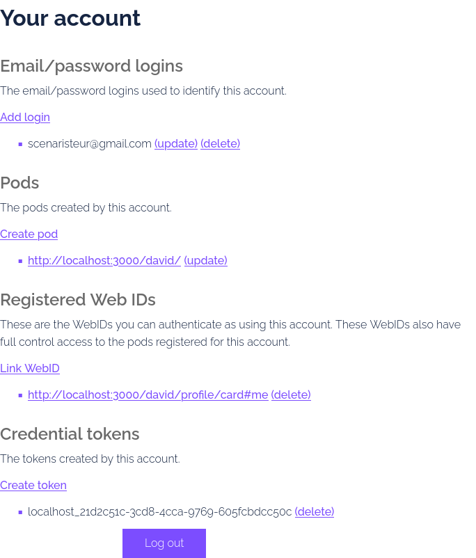

# Getting started
- first thing to start is good musik https://www.radiofrance.fr/fip/radio-groove
- inspired from https://github.com/scenaristeur/agent, demo https://www.youtube.com/watch?v=YT61BcjGfwc


# adding data
> data insertions ends with ',' ';' '.' or '-'
adding data follows the tripet s:p:o format (subject, predicate, object), ending with ',' ';' '.' or '-'
see demo https://www.youtube.com/watch?v=YT61BcjGfwc


# commands
> commands start with '/'
- [ X ] /dbls or /dbs: list all databases
- [ X ] /db [something]: connect to a [something] database, default is /organizm.default.db
- [ X ] /get or /g : get data, accept filters (see below)


# /get filters
according to https://github.com/levelgraph/levelgraph?tab=readme-ov-file#get-and-put
s = subject, p = predicate, o = object, l = limit, o = offset, r = reverse

- /get s:dav p:eat => get all data where subject is 'dav' and predicate is 'eat'


# Run a Community Solid Server
- https://communitysolidserver.github.io/CommunitySolidServer/latest/
```
# install
npm install -g @solid/community-server
# run
community-solid-server -c @css:config/file.json -f ~/.organizm/solid_data/
```
then 
- open http://localhost:3000 to see if CSS (Community Solid Server) is running 
- sigup for an account at http://localhost:3000/.account/login/password/register/
- create a pod and a token




# .env
- cp .env_example to .env and replace this values with yours

```
VITE_SOLID_BASE_URL="http://localhost:3000"
VITE_SOLID_POD="http://localhost:3000/xxxxxxxxxx/"
VITE_SOLID_WEBID="http://localhost:3000/xxxxxxxxxxxx/profile/card#me"
VITE_SOLID_TOKEN_IDENTIFIER="localhost_xxxxxxxxxxxx"
VITE_SOLID_TOKEN_SECRET="xxxxxxxxxxxxxxxxxxxxxxxxx"
```

# run 

```
# prod 
npm start
# dev 
npm run dev
```

# Default Data Folder
- $HOME/.organizm/ 


# 
- no-stdin with nodedemon in dev ( known issues https://www.npmjs.com/package/inquirer#methods )https://github.com/SBoudrias/Inquirer.js/issues/844#issuecomment-736675867 